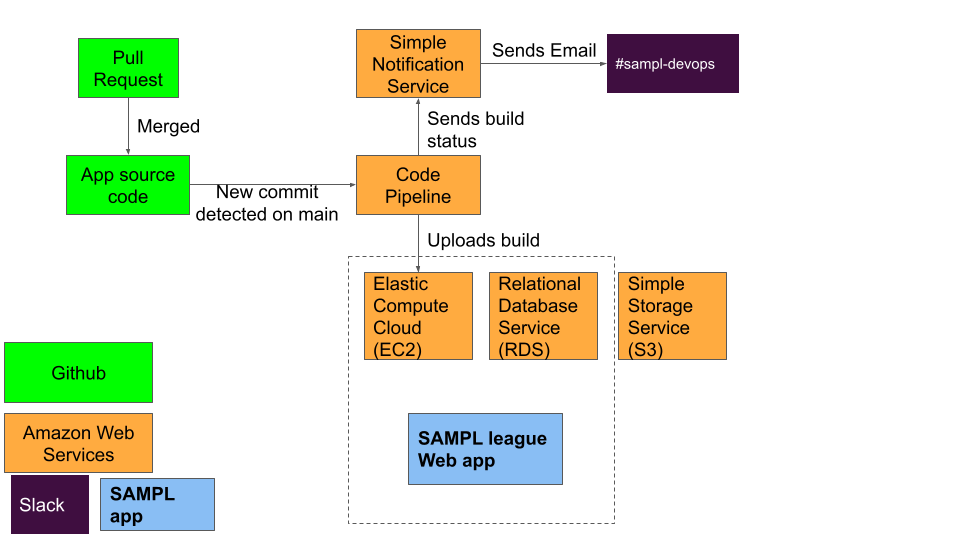

Admin Tasks
***********

General overview
================

When a commit is made to the ``main`` branch (e.g. merging in a pull request that targets the ``main`` branch) a build is trigged on `Code Pipeline`_.
Then a notification is sent (using `SNS`_) to the ``#sampl-devops`` channel in the Mobley Lab `Slack workspace <https://mobleylab.slack.com>`_.
Once the build completes, the code is sent to the `Elastic Beanstalk`_ instance and the web service restarted.

Amazon Web Services infrastructure (AWS)
---------------------------------------

All services are hosted in US East (Ohio) us-east-2.

- Code Deployment: `Code Pipeline`_
- Container Registry: `ECR`_
- DNS: `Route 53`_
- Database: `RDS`_
- E-mail: `SES`_
- Elastic Beanstalk: `Elastic Beanstalk`_
- Monitoring & Alarms: `Cloud Watch`_
- Slack E-mail messages: `SNS`_
- Storage: `S3`_
- Web Server: `EC2`_

Update ``ever_given``
---------------------

You will need an account on `PyPI`_.
Starting from the root of the repository (after making changes to the code):

.. code-block:: bash

   $ cd ever_given
   $ python -m pip install --upgrade build
   $ python -m build
   $ python3 -m twine upload  dist/*

The new package should show up `here <https://pypi.org/project/ever-given/#history>`_.

Spin up worker
--------------

Generally:

#. Provision an EC2 instance
#. SSH onto instance and clone codebase
#. Use `pipenv` to setup environment
#. Ensure environmental variables are set
#. Launch as many `dask-workers` as needed

Expand Local Storage On EC2 Instance
------------------------------------

First, follow the guide `"Modify an EBS volume using Elastic Volumes" <https://docs.aws.amazon.com/AWSEC2/latest/UserGuide/requesting-ebs-volume-modifications.html#modify-ebs-volume>`_.
Then follow the steps below (adapted from `"Extend a Linux file system after resizing a volume" <https://docs.aws.amazon.com/AWSEC2/latest/UserGuide/recognize-expanded-volume-linux.html>`_).

.. code-block:: bash

   $ df -hT # Check disk space, mount points, and file system type
   $ lsblk # Check which device needs to be expanded
   $ sudo growpart /dev/nvme0n1 1
   $ df -hT # Confirm that nothing has changed on the file level
   $ lsblk # Check to see that partition has grown
   $ sudo xfs_growfs -d / # Be sure to use the correct tool to grow the file system
   $ df -hT # Confirm that everything looks correct

While doing a backup first is not a bad idea, since the database is part of another service and S3 is used for storage, if a major crash occurs during this operation, the web server can be restarted and things *should* be fine.

.. _Cloud Watch: https://us-east-2.console.aws.amazon.com/cloudwatch/home?region=us-east-2#dashboards:name=Sampl-League
.. _Code Pipeline: https://us-east-2.console.aws.amazon.com/codesuite/codepipeline/pipelines/sampl/view?region=us-east-2
.. _EC2: https://us-east-2.console.aws.amazon.com/ec2/v2/home?region=us-east-2#Instances:
.. _ECR: https://us-east-2.console.aws.amazon.com/ecr/repositories?region=us-east-2
.. _Elastic Beanstalk: https://us-east-2.console.aws.amazon.com/elasticbeanstalk/home?region=us-east-2#/environment/dashboard?applicationName=SAMPL-league&environmentId=e-bkz8t2g9mq
.. _PyPI: https://pypi.org/
.. _RDS: https://us-east-2.console.aws.amazon.com/rds/home?region=us-east-2#databases:
.. _Route 53: https://console.aws.amazon.com/route53/v2/hostedzones#ListRecordSets/Z01835681J808IAHZUIMB
.. _S3: https://s3.console.aws.amazon.com/s3/buckets/sampl-league-storage?region=us-east-2&tab=objects
.. _SES: https://us-east-2.console.aws.amazon.com/sesv2/home?region=us-east-2#/account
.. _SNS: https://us-east-2.console.aws.amazon.com/sns/v3/home?region=us-east-2#/dashboard
